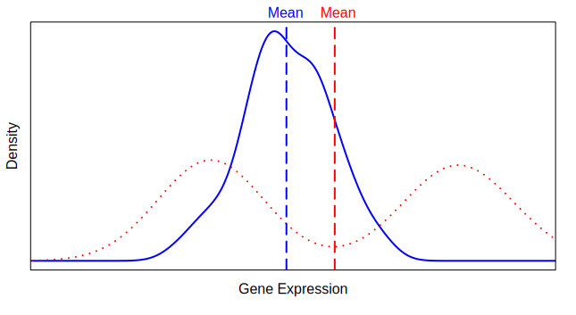

---
output:
  xaringan::moon_reader:
    css: ["default", "styling/sydney-fonts.css", "styling/sydney.css"]
    self_contained: false
    seal: true
    nature:
      beforeInit: ["styling/remark-zoom.js"]
      highlightStyle: github
      highlightLines: true
      countIncrementalSlides: false
      ratio: '16:9'
      navigation:
        scroll: false
---

class: title-slide
background-image: url("styling/USydLogo-black.svg"), url("styling/title-image1.jpg")
background-position: 10% 90%, 100% 50%
background-size: 160px, 100% 100%

.content-box-purple[
# .black[Activity 1]
## Selecting Biomarkers and Making Predictions of Treatment Resistance
### Ellis Patrick
### 29 June 2018
]

---

## Activity Overview

- RNA-seq Data Set: Acute Myeloid Leukaemia Treatment Resistance

--

- ClassifyR: Biomarker Selection Methods and Cross-validation

--

- Differential Means and Differential Distribution Classifiers for Classifying AML Patients

---

## RNA-seq Data Set: Acute Myeloid Leukaemia (AML) Treatment Resistance

- Primary therapy resistance is a major problem in acute myeloid leukemia treatment. Approximately 20–30% of younger adult patients with AML and as many as 50% of older adults are refractory to induction treatment.

--

- Research findings are <a href="http://www.haematologica.org/content/103/3/456" target="_blank">published</a> in *Haematologica* in 2018.

--

- The data is available from <a href="https://www.ncbi.nlm.nih.gov/geo/query/acc.cgi?acc=GSE106291" target="_blank">GEO Browser</a> as 250 `txt.gz` files of gene-level read counts or a Microsoft Excel file where the gene expression values were standardised to have a mean of 0 and variance of 1.

--

```{r, echo = FALSE}
library(knitr)
opts_knit[["set"]](root.dir = "/home/dario/Documents/tutorial/")
options(width = 90)
```

Import the prepared tab-separated text files of RNA-seq read counts and clinical data.

```{r}
readCounts <- read.delim("data/counts.txt", check.names = FALSE)
readCounts <- as.matrix(readCounts)
sampleInfo <- read.delim("data/samples.txt", check.names = FALSE)
```

---

## Clinical Data

The cinical data provides information about seven different characteristics of the patients.


```{r}
head(sampleInfo)
nrow(sampleInfo)
```

---

## Clinical Data

Observe the number of samples which are resistant to treatment and which are not.

```{r}
table(sampleInfo[, "Response"])
```

--

$164 + 71 = 235$, so there are 15 patients with missing data regarding their resistance. Identify which rows of the clinical data they are in.

```{r}
removeClinical <- which(is.na(sampleInfo[, "Response"]))
```

---

## AML Read Counts

```{r}
dim(readCounts)
```

There are `r nrow(readCounts)` genes in the counts table and `r ncol(readCounts)` AML patients.

--

```{r}
readCounts[1:6, 1:6]
```

---

## AML Read Counts

The number of reads per sample varies widely betwen patients by as much as 10-fold.

```{r}
samplesCounts <- colSums(readCounts)
countsSummary <- summary(samplesCounts)
countsSummary
```

--

Identify in which columns of the matrix patients with less than the first quartile of counted reads and more than the third quartile are to remove them from the analysis.

```{r}
removeRNA <- which(samplesCounts < countsSummary["1st Qu."] |
                   samplesCounts > countsSummary["3rd Qu."])
```

---

## Subsetting the Data Set

Remove samples which have a number of read counts below the first quartile of counted reads or above the third quartile as well as those missing resistance status.

```{r}
allRemove <- union(removeClinical, removeRNA)
readCounts <- readCounts[, -allRemove]
sampleInfo <- sampleInfo[-allRemove, ]
```

--

Caclulate the number of remanining samples belonging to each class.

```{r}
classes <- sampleInfo[, "Response"]
table(classes)
```

--

There is a moderate amount of class imbalance in this data set.

---

## Relationship of Mean and Variance

- RNA-seq count measurements are known to have a relationship between mean and variance.

--

- Many classification algorithms require data with constant variance over the range of means.

--

Scale each sample's counts to be the same as the sample in the first column.

```{r}
scaleFactors <- colSums(readCounts)[1] / colSums(readCounts)
scaledCounts <- t(t(readCounts) * scaleFactors)
```

---

## Relationship of Mean and Variance

Observe the mean-variance relationship.

```{r, message = FALSE, warning = FALSE, fig.align = "center", fig.height = 5, fig.width = 5}
library(EDASeq)
AMLExpressionSet <- newSeqExpressionSet(scaledCounts)
meanVarPlot(AMLExpressionSet, log = TRUE, main = "Mean-Variance Plot")
```

---

## Relationship of Mean and Variance

Using DESeq2's `varianceStabilizingTransformation` function, remove the relationship of variance to mean.

```{r, warning = FALSE}
library(DESeq2)
measurementsVS <- varianceStabilizingTransformation(readCounts)
normCounts(AMLExpressionSet) <- measurementsVS
```

---

## Relationship of Mean and Variance

Visualise again the relationship between mean and variance.

```{r, fig.align = "center", fig.height = 5, fig.width = 5}
meanVarPlot(AMLExpressionSet, xlim = c(0, 9), ylim = c(0, 9),
            main = "Mean-Variance Plot")
```

The variance is now reasonably constant across the range of means.

---

## Subsetting the Data Set Again

Before doing any classification, the number of genes will be reduced to make feature selection faster. The top 2000 most variable genes are retained.

```{r}
geneVariances <- apply(measurementsVS, 1, var)
mostVariable <- order(geneVariances, decreasing = TRUE)[1:2000]
measurementsVS <- measurementsVS[mostVariable, ]
measurementsVS[1:6, 1:6]
```

Class information is not used, so the filtering is fair. The most variable gene is XIST, a gene involved with X chromosome inactivation, a process by which one of the two copies of the X chromosome present in female mammals is inactivated.

---

## ClassifyR

- A *framework* for feature selection, cross-validated classification and its performance evaluation.

--

- Some popular feature selection methods and classifiers implemented in the package.
--

- Runs cross-validation in parallel on Windows, MacOS, Linux operating systems.

--

- Supports numeric-only (`matrix`) data, mixed numeric-categorical (`DataFrame`) data and multi-omics data (`MultiAssayExperiment`). 

--

- Continually maintained and supported (first released in 2014).

---

## Parameter Objects

- Each stage of classification is defined by a parameter object.

--

- The four main types of objects are `TransformParams`, `SelectParams`, `TrainParams` and `PredictParams`.

--

- `TransformParams` and `SelectParams` are optional.

---

## Getting Help Using ClassifyR

- Every Bioconductor package has a vignette which demonstrates the main usage on an example data set. ClassifyR's HTML vignette is available from the <a href="https://bioconductor.org/packages/release/bioc/html/ClassifyR.html" target="_blank">package's home page</a>.

- The <a href="https://support.bioconductor.org/" target="_blank">Bioconductor Support Forum</a> is the best communication channel to ask questions about packages.

---

## Cross-validation

- The process of creating many different training and test sets is handled by `runTests`.

--

- The `seed` option allows the specification of a number which results in cross-validations which rely on random splits to be reproduced if the code is rerun, even if it runs on multiple cores.

--

- The result of running `runTests` is a `ClassifyResult` object, which many performance evaluation functions use.

--

- A `ClassifyResult` object stores the class predictions and possibly also class scores as well as the features selected at each cross-validation iteration.

---

## Differential Means Classifier for AML Resistance

- The default feature selection method of `SelectParams` is a moderated t-test based ranking and selection of the top $p$ genes that give the best resubstitution error (considering 10, 20, ..., 100 top-ranked features). See `?SelectParams` for the specification.

--

- The default training and prediction methods for `TrainParams` and `PredictParams` are for Diagonal Linear Discriminant Analysis (DLDA). See `?TrainParams` and `?PredictParams` for the specification.

---

## Differential Means (DM) Classifier for AML Resistance

Run 20 permutations and 5 folds cross-validation.

--

```{r, message = FALSE}
library(ClassifyR)
```

```{r}
classifiedDM <- runTests(measurementsVS, classes, "AML", "DLDA",
                         permutations = 20, seed = 2018)
classifiedDM
```

---

## Parallel Processing

- By default, 2 less cores than the computer has are used.

- On Windows, use `parallelParams = SnowParam(workers = 8)` to use 8 cores and on Linux or MacOS use `parallelParams = MulticoreParam(workers = 8)` as an arguent to `runTests` to achieve the same customisation.

---

## Accessing the Chosen Features

- Rarely done directly by you.
- The `features` accessor extracts all of the feature selections at each iteration of cross-validation.

```{r}
# Permutation 1, folds 1 and 2.
features(classifiedDM)[[1]][1:2]
```

---

## Accessing the Predictions

- The `predictions` accessor gets all of the class predictions.

```{r}
# Permutation 1
head(predictions(classifiedDM)[[1]])
```

---

## Most Frequently Selected Feature

The `distribution` function calculates the feature selection frequency of all features.

```{r}
frequencies <- distribution(classifiedDM, plot = FALSE)
frequencies <- sort(frequencies, decreasing = TRUE)
head(frequencies)
```

`r names(frequencies)[1]` is chosen `r frequencies[1]` out of 100 possible times.

---

## Most Frequently Selected Feature

The distribution of gene expression per class can be quickly visualised with `plotFeatureClasses`.

```{r, fig.height = 4, fig.width = 7, fig.align = "center"}
plotFeatureClasses(measurementsVS, classes, targets = names(frequencies)[1],
                   whichNumericPlots = "density", xAxisLabel = "RNA-seq Abundance")
```

The gene is visibly differentially expressed between resistant and sensitive patients.

---

## Clinical Data Quality Check

ZFY is a gene on the Y chromosome which only males have. Plot its expression with the gender in place of the treatment resistance classes.

```{r, fig.height = 4, fig.width = 7, fig.align = "center"}
plotFeatureClasses(measurementsVS, sampleInfo[, "Gender"], targets = "ZFY",
                   whichNumericPlots = "density", xAxisLabel = "RNA-seq Abundance")
```

The abundance grouped by gender is as expected.

---


## Differential Distribution (DD) Classifier for AML Resistance

Both changes in means and changes in variances can be useful for making class predictions.

.center[]

---

## DD Feature Selection Setup

Numerous DD selection methods are available in ClassifyR. <a href="https://bioconductor.org/packages/release/bioc/vignettes/ClassifyR/inst/doc/ClassifyR.html#provided-feature-selection-and-classification-methods" target="_blank">Section 0.9 of the vignette</a> gives an overview. For this example, Kullback-Leibler divergence will be used.

--

Navigate to the Reference Manual (PDF) of <a href="https://bioconductor.org/packages/release/bioc/html/ClassifyR.html" target="_blank">ClassifyR</a> to see the formula.

--

```{r}
selectParams <- SelectParams(KullbackLeiblerSelection,
                             resubstituteParams = ResubstituteParams())
```

By default, the mean is the location and the standard deviation is the scale.

---

## DD Classifier Setup

A variety of DD classifiers are available in ClassifyR. For this example, the naive Bayes method will be used. The difference of the height (scaled by the number of samples in each class) between the kernel densities of the two classes is used by each gene to vote for one class. The class with the most votes is the predicted class of the patient.

```{r}
trainParams <- TrainParams(naiveBayesKernel)
```

--

`naiveBayesKernel` trains a classifier and returns a factor vector of class predictions, so there is no other function used for predictions.

```{r}
predictParams <- PredictParams(NULL, weighted = "unweighted", weight = "height difference",
                               getClasses = function(result) result)
```

---

## DD Cross-validated Classification

As was done for DM classification, 20 permutations and 5 fold cross-validation is done.

```{r}
classifiedDD <- runTests(measurementsVS, classes, "AML", "naive Bayes Voting",
                         params = list(selectParams, trainParams, predictParams), #<<
                         permutations = 20, seed = 2018)
classifiedDD
```

---

## Logsitic Regression Classifier for AML Resistance

- Classifier built using only the routinely collected clinical information.

--

- *Multinomial* logistic regression is not available by default in R, but is available from mnlogit.

--

- `logisticRegressionTrainInterface` is a wrapper around the `mnlogit` fitting function.

--

- `logisticRegressionPredictInterface` is a wrapper around the `predict` function for objects of class `mnlogit`.

---

## Logsitic Regression Classifier for AML Resistance

Specify the training and prediction settings.

```{r}
trainParams <- TrainParams(logisticRegressionTrainInterface)
predictParams <- PredictParams(logisticRegressionPredictInterface,
                               getClasses = function(result) result)
```

Run 20 permutations and 5 folds cross-validation, ignoring GEO ID, Survival Time and Status.

```{r}
ignoreColumns <- match(c("ID", "Survival Time", "Status"), colnames(sampleInfo))
ignoreColumns
classifiedClinical <- runTests(DataFrame(sampleInfo[, -ignoreColumns]), "Response",
                               "AML", "Logistic Regression",
                               params = list(trainParams, predictParams), #<<
                               permutations = 20, seed = 2018)
```

---

## Logsitic Regression Classifier for AML Resistance

```{r}
classifiedClinical
```

---

## After the Break

- Evaluation of feature selection stability.

- Evaluation of overall error, sample-specific error, precision, recall.

- Comparison of the three different classifiers.


